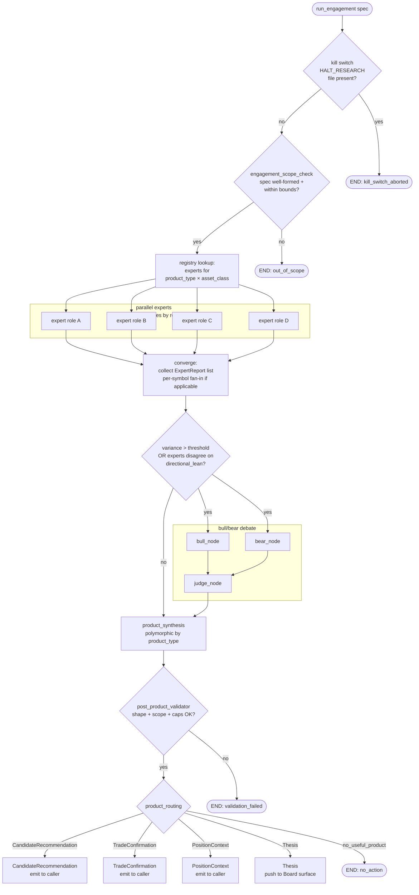

# Research Firm — Design Document v3

**Status:** APPROVED — v3 sign-off 2026-05-01 (Board ratification of
the v2→v3 reframe in the same session that shipped + retired v2 Phase
1a). v3.1 refinement pass 2026-05-01: §1.5 / §3.6 / §6.3 / §7.3 /
§8 / §8.A / §8.B / Appendix A updates per pre-1a-1 review (Phase 1a
split into 1a-1 + 1a-2; data-fetch audit kind failure-only; latency
time-series view; extended-outage alerting; Layer 2 modifications
validation scoped to structural-only). All open questions Q1–Q14
resolved or carried with explicit recommendations. Phase 1a-1
implementation session unblocked.

**v3.2 amendment 2026-05-01** (post-1a-2 ship): §1.2 / §8.A clause
(a) step 1 / §8.A clause (d) / Q3 — PMCC scout capacity calc
overridden by Board to be buying-power-based with NO hard count cap
on concurrent PMCCs. The original `max_concurrent_pmccs -
currently_held_pmcc_count` formulation is retired; capacity is
governed exclusively by `cash_reserve_floor_pct`. Implementation
shipped in Phase 1a-2 already reflects this; doc updated to match.

**v3.3 amendment 2026-05-01** (during-1b ship): §1.3 row 4 / §7.4 /
Phase 1b Ship list — the `/research thesis <symbol>` Telegram command
is deferred. Phase 1b ships the `Thesis` synthesis path, dashboard
library view, and audit trail, but the Telegram surface is stubbed
(`_on_research` returns a "not wired in this phase" reply). Engagement
runs via `run_engagement(spec, deps=...)` regardless of trigger.
Reprioritize when there's a live consumer for the Telegram surface;
the dispatch is one function in `main.py`.

**Scope of this doc:** architecture only. No code changes in this
session. This is the contract the implementation session will follow.

**Change from v2:** v2 framed `WatchlistRecommendation` as a
load-bearing product whose output is a curated, persisted list mutated
into `config/strategies.yaml` via auto-apply (Phase 1b) and refreshed
by a research-team-owned scheduler (Phase 1h). The Board rejected this
framing on review after observing v2 Phase 1a's BEN/FITB/VTR output:
even with perfect curation, a list is a snapshot, and the world moves
between snapshots. v3 reframes the research firm as a **stateless
shared service / research team** that answers typed questions on
demand. Per-division code owns when/whether to ask, what to ask for,
and what to do with the answer. There is no team-owned trigger,
scheduler, capacity logic, universe concept, or watchlist. The team
has an inbox.

**What survives from v2:** the engagement framework
(`EngagementSpec`, kill switch, scope-check Layer 1, post-product
validator Layer 2, audit-before-branch); the LangGraph subgraph shape
(parallel experts → converge → debate-on-disagreement → synthesis →
routing); deterministic-then-narrate; expert isolation from broker
creds; no schema changes to existing tables.

**What's new in v3:** four product types replace v2's four (with
overlapping shapes); experts replace analysts as the unit of skill; a
registry maps `(product_type, asset_class)` to expert sets at
build time; HITL approval moves entirely to the order path (no
approval of recommendations as a unit); per-division audit kinds
(`research_candidate_acted_on` / `research_candidate_skipped`) close
the act-rate measurement gap.

**Relationship to CLAUDE.md:** every §1 invariant honored. The two §7
sharp edges that brushed v2's design (webhook-vs-graph gate
asymmetry; `_check_auto_execute` action-mapping coverage) no longer
apply because v3 has no `TradeProposal` product type and no
research-specific action strings. The two new explicit-approval
categories v2 flagged for CLAUDE.md (config writes, LLM-isolated apply
paths) are no longer needed — there is no `config_writer.py` in v3.

---

## 1. Shared service model (research team with an inbox)

### 1.1 Why the research firm is not a division (and not a watchlist)

Divisions in this codebase = (broker × account × strategy). They have
a book. They take positions. They have realized P&L attached to a
specific account. They appear in
[config/divisions.yaml](../config/divisions.yaml). The research firm
has none of those things.

v2 explored two framings:

- **As a division** (rejected): forced the team into a (broker ×
  account × strategy) shape it doesn't fit; required a synthetic
  paper-research account.
- **As a curator of a persisted watchlist** (rejected after v2
  Phase 1a ship): the watchlist artifact rotted between refreshes,
  required a Board approval flow for symbol-list membership distinct
  from the order-approval flow already in place, and added a
  config-writer module (Phase 1b) that was the riskiest new code in
  the design and bought no analytical lift.

v3 framing: **shared service / research team.** The team is
structured like a sell-side research desk inside a multi-strategy
fund. It has a roster of experts; it accepts typed engagements; it
returns typed answers. Trading desks (divisions) decide what to act
on. The research team doesn't trade.

### 1.2 The team has an inbox, not a clock

The team is **stateless** from its own perspective. Per engagement,
it receives everything it needs to answer. It does not own:

- **Triggers** — no cron, no webhook, no schedule. A division decides
  *when* to ask.
- **Capacity awareness** — divisions compute their own capacity
  (PMCC scout uses buying-power-minus-cash-floor; other divisions may
  use their own math) and pass it as scope input.
- **Universe concept** — divisions either pass the candidate space
  (`starter_universe_key`) or the team screens broadly within the
  declared `asset_class`.
- **Mandate** — divisions load their own strategy block from
  `config/strategies.yaml` and pass it verbatim into
  `CandidateScope.mandate`. The team does not look up mandates by
  division slug.
- **Watchlist** — outputs are transient. A `CandidateRecommendation`
  emitted at 9:30 ET is good *for this scan*. Tomorrow's scan asks
  again with fresh data.

The team's only persistent state is the `audit_event` row trail —
which is the historical record of what was asked, what was answered,
and what the asking division did with it.

### 1.3 The four product types

| Product | Shape of question | Used by |
|---|---|---|
| **`CandidateRecommendation`** | "Find me N things that fit these criteria." | Divisions that need selection (PMCC scout for new LEAP underlyings; future divisions that need to pick a target) |
| **`TradeConfirmation`** | "I'm considering doing X. Confirm or push back." | Divisions that have already formed an idea and want a second opinion before placing (Lord Otter, Market Cypher; future event-driven divisions) |
| **`PositionContext`** | "What's the situational picture for X right now?" | Divisions that want awareness without a recommendation (Otter / Cypher pre-trade context, future scenario-monitoring) |
| **`Thesis`** | "Tell me about X." | Board ad-hoc only — no division consumes Thesis in production flow |

### 1.4 Per-division responsibilities (NOT the research team's job)

Each division owns:

- **WHEN to ask** — schedule, event, capacity-driven, user-initiated
- **WHETHER to ask** — capacity / halt / armed state — division-specific math
- **WHICH product type to ask for** — matches the question they're trying to answer
- **WHAT to do with the answer** — decide per-candidate, build orders, consume context internally, surface to Board
- **AUDIT what they did** — every consumed candidate gets an audit
  row from the division (`research_candidate_acted_on` or
  `research_candidate_skipped`); see §4.5

The research team accepts engagements, runs them, returns answers.
Stateless from its perspective.

### 1.5 No own broker, no own auto_execute, no order construction

The research firm:

- Does **not** appear in `config/divisions.yaml`.
- Does **not** register a broker.
- Has **no** `auto_execute` setting of its own.
- Does **not** construct `ProposedOrder`s.

A `CandidateRecommendation` or `TradeConfirmation` *informs* a
division's order construction; the division still calls its own
`_build_order` and the order flows through the normal CEO graph (risk
gate + HITL). The research firm never bypasses these paths.

**The research firm *informs*; `RiskAgent.evaluate()` *decides*** —
even for `TradeConfirmation` conditional verdicts where the
engagement suggests size/price/side modifications. The single risk
chokepoint (CLAUDE.md §1) is downstream of the engagement, not a peer
of it. Layer 2 modifications validation is structural-only (see §6.3);
the policy gate stays exactly where it always has been.

The order's `extra` block carries the engagement_id so the audit
trail joins the trade to the research that produced it:

```python
{
    "via": "research_firm_engagement",
    "engagement_id": "<uuid>",
    "product_type": "candidate_recommendation",  # or "trade_confirmation"
    ...
}
```

---

## 2. The cycle subgraph (parameterized by engagement)

### 2.1 Mermaid diagram



### 2.2 Expert set is registry-driven

The `(product_type, asset_class)` pair drives expert selection at
graph build time (or at engagement init time — implementation choice).
Registry definition + Phase 1 mapping in §5.

For products that operate on multiple symbols (`CandidateRecommendation`
when the team screens for candidates), the expert fan-out is per
symbol per role; converge collects all reports and groups by symbol
for synthesis.

For single-symbol products (`TradeConfirmation`, `PositionContext`,
`Thesis`), each registered expert runs once on the spec's symbol.

### 2.3 State shape

`EngagementState` TypedDict in `agents/research/state.py`. Separate
from [graph/ceo_graph.py:281-293](../trading_corp/graph/ceo_graph.py)
`TradeFlowState` — no schema collision, no extension.

```python
class EngagementState(TypedDict, total=False):
    engagement_id: str
    engagement_spec: dict             # EngagementSpec.model_dump()
    product_type: str                 # see §3.1 enum
    asset_class: str                  # equity | option | crypto_spot
    requesting_division: str
    triggered_by: str
    triggered_ts: str
    engagement_started_ts: str        # set in kill_switch_check_node (Q11)

    kill_switch_present: bool
    scope_ok: bool
    scope_reject_reason: str | None

    expert_roles: list[str]           # from registry lookup
    candidates: list[str]             # for multi-symbol products only
    expert_reports: list[dict]        # ExpertReport.model_dump() entries
    expert_audit_row_ids: list[int]

    debate_invoked: bool
    debate_invoked_reason: str | None
    debate_outcome: dict | None

    product: dict | None              # serialized product
    product_audit_row_id: int | None

    cost_dollars: float
    cost_warning_emitted: bool

    final_status: Literal[
        "kill_switch_aborted",
        "out_of_scope",
        "validation_failed",
        "no_action",
        "candidate_recommendation_emitted",
        "trade_confirmation_emitted",
        "position_context_emitted",
        "thesis_emitted",
    ] | None
    final_reason: str | None
    engagement_completed_ts: str      # set on terminal nodes (Q11)
```

### 2.4 Checkpointer

**`checkpointer=None` for the engagement graph in production**, by
deliberate decision following v2 Phase 1a's `database is locked`
incident (see CHANGELOG of this design doc / engagement runner). v2
proposed sharing the CEO graph's `AsyncSqliteSaver`; in practice the
CEO graph holds a write transaction open during HITL `interrupt()`
waits, which collides with research-firm audit writes. v3 engagements
are one-shot (no `interrupt()`, no resume), so checkpointing has no
functional value.

If a future product type (e.g. a long-running backtest engagement)
ever requires resume, swap to a separate saver with its own DB file —
do not re-share the CEO saver.

### 2.5 Invocation

```python
# agents/research/engagement.py
async def run_engagement(
    spec: EngagementSpec,
    *,
    deps: ResearchFirmDeps,
) -> ResearchProduct | None:
    """Returns the typed product, or None on abort (kill switch /
    out-of-scope / no-action / validation_failed)."""
    ...
```

`ResearchProduct` is a typed union of the four product types.

---

## 3. Schemas

All schemas at **`agents/research/schemas.py`** (rewrite of v2 file).
Pydantic v2 (Phase 1a still ships this dependency from v2).

### 3.1 EngagementSpec — top-level

```python
from pydantic import BaseModel, Field, model_validator
from typing import Literal, Union
import uuid


RequestingDivision = Literal[
    "robinhood_pmcc",
    "robinhood_ira",
    "robinhood_joint",
    "lord_otter",
    "market_cypher",
    "fidelity_options",
    "board",
]

ProductType = Literal[
    "candidate_recommendation",
    "trade_confirmation",
    "position_context",
    "thesis",
]

AssetClass = Literal["equity", "option", "crypto_spot"]


class EngagementSpec(BaseModel):
    engagement_id: str = Field(default_factory=lambda: str(uuid.uuid4()))
    requesting_division: RequestingDivision
    product_type: ProductType
    asset_class: AssetClass
    scope: "Scope"                     # discriminated by product_type
    constraints: dict = Field(default_factory=dict)
    triggered_by: Literal["division_agent","telegram","dashboard"]
    triggered_ts: str

    @model_validator(mode="after")
    def _scope_matches_product(self) -> "EngagementSpec":
        expected = {
            "candidate_recommendation": CandidateScope,
            "trade_confirmation": TradeConfirmationScope,
            "position_context": PositionContextScope,
            "thesis": ThesisScope,
        }[self.product_type]
        if not isinstance(self.scope, expected):
            raise ValueError(
                f"product_type={self.product_type!r} requires scope of "
                f"type {expected.__name__}, got {type(self.scope).__name__}"
            )
        return self
```

### 3.2 Scope shapes

```python
class CandidateScope(BaseModel):
    """For 'find me N things that fit' questions.

    `mandate` is the requesting division's strategy block loaded
    verbatim from config/strategies.yaml (see Q4). The research team
    does NOT interpret division config; it passes the dict to the
    synthesis prompt for the LLM to use as fit context.

    `capacity_dollars` is computed by the requesting division (see
    Q3) and used by synthesis to size-frame each candidate's thesis.

    `current_holdings` excludes symbols already held — division
    typically passes its current position list.

    `starter_universe_key`, when present, points at a JSON file under
    data/research_starter_universes/. When absent, experts screen
    broadly within asset_class (Phase 1c+ — Phase 1a always passes
    a starter key for cost predictability)."""
    mandate: dict
    capacity_dollars: float = Field(ge=0.0)
    current_holdings: list[str] = Field(default_factory=list)
    n_candidates: int = Field(ge=1, le=5)
    starter_universe_key: str | None = None
    earnings_buffer_days: int = Field(default=7, ge=0, le=60)


class TradeConfirmationScope(BaseModel):
    """For 'I'm about to do X, sanity-check me' questions.

    `proposed_action` is the division's pre-built order-shape — fields
    typical to the division (symbol, side, size_pct_equity, instrument,
    entry_price, rationale, tier, etc). Schema is intentionally
    free-form because divisions vary; the synthesis prompt formats
    whatever is present.

    `context` is the surrounding situational data — alert payload,
    recent setup state (bias, sommi, arming), regime, etc. Same
    free-form treatment.

    Latency budget for the whole engagement is set per Q11 — Phase 1e
    calibrates the hard timeout from measured P95 of prior phases."""
    proposed_action: dict
    context: dict = Field(default_factory=dict)


class PositionContextScope(BaseModel):
    """For 'what's the situational picture for X' questions.

    Unchanged from v2; already on-demand-shaped. Pre-emptive cache
    pattern (Q7) lives in the consuming agent, not in the engagement
    graph."""
    symbol: str
    time_horizon_hours: int = Field(ge=1, le=168)
    current_position_qty: float
    current_position_avg_price: float
    current_position_age_hours: float


class ThesisScope(BaseModel):
    """For Board ad-hoc 'tell me about X' questions. No production
    decision flow consumes Thesis."""
    symbol: str
    depth: Literal["standard","deep"] = "standard"


Scope = Union[CandidateScope, TradeConfirmationScope, PositionContextScope, ThesisScope]
```

### 3.3 ExpertReport (renamed from v2's AnalystReport)

```python
class EvidenceItem(BaseModel):
    claim: str
    source: str
    source_ts: str | None = None
    confidence: float = Field(ge=0.0, le=1.0)


class ExpertReport(BaseModel):
    """One expert's read on a question. The role is `str` (not Literal)
    so new experts can register without a schema change — the registry
    in §5 enforces which roles are valid for a given product."""
    role: str
    engagement_id: str
    symbol: str                       # may be "" for whole-engagement-level work
    summary: str
    key_evidence: list[EvidenceItem] = Field(default_factory=list)
    confidence_score: float = Field(ge=0.0, le=1.0, default=0.0)
    directional_lean: Literal["bullish","bearish","neutral"] | None = None
    data_sufficiency: bool
    refusal_reason: str | None = None

    @model_validator(mode="after")
    def _refusal_requires_reason(self) -> "ExpertReport":
        if not self.data_sufficiency and not self.refusal_reason:
            raise ValueError(
                "data_sufficiency=False requires non-empty refusal_reason"
            )
        return self
```

### 3.4 DebateOutcome (unchanged from v2)

```python
class JudgeScore(BaseModel):
    evidence_quality: float = Field(ge=0.0, le=1.0)
    logical_consistency: float = Field(ge=0.0, le=1.0)
    falsifiability: float = Field(ge=0.0, le=1.0)
    notes: str


class DebateOutcome(BaseModel):
    engagement_id: str
    symbol: str
    invoked_reason: str
    bull_case: str
    bear_case: str
    judge_bull_score: JudgeScore
    judge_bear_score: JudgeScore
    # Judge scores QUALITY only — never produces a verdict.
    # CLAUDE.md §1: deterministic-then-narrate. Synthesis synthesizes.
    synthesis: str
```

### 3.5 Product schemas

```python
class Candidate(BaseModel):
    """One row inside a CandidateRecommendation.

    `conviction` is the team's "is this a good idea right now" call —
    LLM-narrated, categorical (high/medium/low). It folds in current
    momentum, regime, situational quality.

    `fit_score` is the team's "does this match the division's mandate"
    call — more deterministic, derived from how well the candidate's
    structural attributes (category, IV, liquidity, beta, etc.) line
    up against the mandate dict. Range [0.0, 1.0].

    Both are kept distinct because the cross product is diagnostic:
    high-conviction-low-fit is a red flag (the v2 BEN/FITB/VTR
    pattern — bullish technicals on names that don't match aggressive
    high-IV PMCC underlying_criteria); high-fit-low-conviction is
    "your kind of trade, wrong moment." Synthesis surfaces both so
    consuming divisions can filter on either axis."""
    symbol: str
    thesis: str                       # 1-paragraph
    conviction: Literal["high","medium","low"]
    fit_rationale: str
    fit_score: float = Field(ge=0.0, le=1.0)


class CandidateRecommendation(BaseModel):
    engagement_id: str
    requesting_division: str
    asset_class: str
    candidates: list[Candidate]
    expert_audit_row_ids: list[int] = Field(default_factory=list)
    debate_audit_row_id: int | None = None


class SuggestedModifications(BaseModel):
    """Structured sub-schema for TradeConfirmation conditional verdicts.
    Free-form dict was rejected because it invites the LLM to
    hallucinate field names; adding a new modification type is a schema
    change, which is the point — registry growth, not magic strings.

    All fields except `rationale` are optional. The LLM populates only
    the fields it is suggesting changes to; absent fields mean "leave
    as proposed."""
    size_pct_equity: float | None = Field(default=None, ge=0.0, le=0.10)
    entry_price: float | None = None
    side: Literal["buy","sell"] | None = None
    rationale: str                    # required — why these changes


class TradeConfirmation(BaseModel):
    engagement_id: str
    requesting_division: str
    subject_action: dict              # echoes scope.proposed_action for join traceability
    verdict: Literal["confirm","push_back","conditional"]
    rationale: str
    risks_flagged: list[str] = Field(default_factory=list)
    suggested_modifications: SuggestedModifications | None = None
    expert_audit_row_ids: list[int] = Field(default_factory=list)
    debate_audit_row_id: int | None = None

    @model_validator(mode="after")
    def _conditional_requires_modifications(self) -> "TradeConfirmation":
        if self.verdict == "conditional" and self.suggested_modifications is None:
            raise ValueError(
                "verdict='conditional' requires suggested_modifications"
            )
        return self


class PositionContext(BaseModel):
    """Returned to requesting division agent for internal consumption.
    NOT pushed to Board surface by default — the calling agent decides
    whether to surface or use silently in its own decision flow.

    REGARDLESS of routing, the PositionContext is written to
    audit_event with kind='research_position_context_emitted'. This is
    required by Phase 1d's 'position-context audit trail' dashboard
    view: even though the Board doesn't see PositionContexts in
    real-time, the audit trail must show what the research firm told
    each division agent and when."""
    engagement_id: str
    requesting_division: str
    symbol: str
    time_horizon_hours: int
    macro_summary: str
    sentiment_summary: str
    risk_flags: list[str] = Field(default_factory=list)
    confidence_score: float = Field(ge=0.0, le=1.0)
    expert_audit_row_ids: list[int] = Field(default_factory=list)


class Thesis(BaseModel):
    """Board ad-hoc only. Renamed from v2 UnderlyingThesis — applies
    to any asset class, not just equity underlyings. No fit_score
    here because Thesis is exploratory, not divisionally targeted."""
    engagement_id: str
    symbol: str
    summary: str                      # 1-paragraph thesis
    key_drivers: list[str]
    key_risks: list[str]
    earnings_window_clear: bool
    expert_audit_row_ids: list[int] = Field(default_factory=list)
    debate_audit_row_id: int | None = None


# Convenience union for typed return signatures elsewhere.
ResearchProduct = Union[
    CandidateRecommendation,
    TradeConfirmation,
    PositionContext,
    Thesis,
]
```

**No `TradeProposal` schema.** v2 had one; v3 collapses it. A division
acting on a `CandidateRecommendation` constructs a `ProposedOrder` via
its existing `_build_order` and tags `extra.engagement_id`. The
research team does not build orders.

### 3.6 Audit kinds — v3 inventory

Single source of truth, in `schemas.py` as constants. Engagement-side:

| Constant | Kind string | When |
|---|---|---|
| `AUDIT_KIND_ENGAGEMENT_STARTED` | `research_engagement_started` | After kill-switch + scope checks pass; payload includes `engagement_started_ts` (Q11) |
| `AUDIT_KIND_ENGAGEMENT_KILLSWITCH` | `research_engagement_aborted_kill_switch` | Kill switch present |
| `AUDIT_KIND_ENGAGEMENT_OUT_OF_SCOPE` | `research_engagement_aborted_out_of_scope` | Scope check rejects |
| `AUDIT_KIND_DATA_FETCH` | `research_data_fetch_attempted` | **Fires ONLY on FAILURE** (rate limit, timeout, schema change, network error). Successful fetches are silent — the ExpertReport itself is evidence of retrieval. Reduces row volume by orders of magnitude; keeps diagnostic signal in failures, not successes. |
| `AUDIT_KIND_EXPERT_COMPLETED` | `research_expert_completed` | Expert returned data_sufficiency=True |
| `AUDIT_KIND_EXPERT_REFUSED` | `research_expert_refused` | Expert returned data_sufficiency=False |
| `AUDIT_KIND_DEBATE_INVOKED` | `research_debate_invoked` | Variance/disagreement triggers debate (Phase 1f) |
| `AUDIT_KIND_DEBATE_COMPLETED` | `research_debate_completed` | Judge scored both sides |
| `AUDIT_KIND_CANDIDATE_RECOMMENDATION_EMITTED` | `research_candidate_recommendation_emitted` | CandidateRecommendation produced |
| `AUDIT_KIND_TRADE_CONFIRMATION_EMITTED` | `research_trade_confirmation_emitted` | TradeConfirmation produced |
| `AUDIT_KIND_POSITION_CONTEXT_EMITTED` | `research_position_context_emitted` | PositionContext produced (regardless of caller use) |
| `AUDIT_KIND_THESIS_EMITTED` | `research_thesis_emitted` | Thesis produced |
| `AUDIT_KIND_VALIDATION_FAILED` | `research_engagement_validation_failed` | Layer 2 rejects |
| `AUDIT_KIND_NO_ACTION` | `research_engagement_no_action` | Synthesis concludes no useful product, or hard cost-cap, or timeout |
| `AUDIT_KIND_COST_WARNING` | `research_engagement_cost_warning` | Soft cost-cap crossed mid-engagement |

Division-side (NEW in v3 — see §4.5):

| Constant | Kind string | Written by |
|---|---|---|
| `AUDIT_KIND_CANDIDATE_ACTED_ON` | `research_candidate_acted_on` | The division (NOT research firm) when it builds a ProposedOrder from a candidate |
| `AUDIT_KIND_CANDIDATE_SKIPPED` | `research_candidate_skipped` | The division when it consumes a candidate but declines to build an order |
| `AUDIT_KIND_RESEARCH_EXTENDED_OUTAGE` | `pmcc_research_extended_outage` | Scout (`actor=pmcc_robinhood`) after N consecutive `pmcc_scan_research_unavailable` rows. Threshold default 3, configurable in `config/risk.yaml` as `research_outage_alert_threshold`. Payload: consecutive failure count, time since first failure, last successful engagement_id (if any). See §8.A clause (c). |

Every engagement-side row has `actor="research_firm"`. Division-side
rows have `actor=<division_slug>` and `payload.engagement_id` to
join.

**Dropped from v2:** `research_watchlist_emitted`,
`research_trade_proposal_emitted`,
`research_watchlist_approval_recorded`, `research_watchlist_rejected`,
`research_watchlist_applied`. None of these have a v3 analog.

**Terminal-row timestamp pinning (Q11):** every terminal audit row
(the four `*_emitted` plus `validation_failed` and `no_action`)
includes both `engagement_started_ts` (copied from start) and
`engagement_completed_ts` (= ts of this row). This lets the dashboard
compute durations from a single audit row without joining — same row
has both bookends. Q12 carried-over rule (don't modify CEO graph
audit writes) is honored: order-side audit rows are unchanged.

---

## 4. Integration with existing pipeline

### 4.1 Engagement entry point

```python
# agents/research/engagement.py
async def run_engagement(
    spec: EngagementSpec,
    *,
    deps: ResearchFirmDeps,
) -> ResearchProduct | None:
    ...
```

Callers (Phase 1a only the first; others land in their phase):

- **PMCC scout** (Phase 1a, division_agent): calls
  `run_engagement(CandidateScope)` per scan iteration — see §8 Phase
  1a for the full integration spec.
- **Telegram bot** (Phase 1a-1b, telegram): `/research candidate
  <division> <n>` for ad-hoc CandidateRecommendation; `/research
  thesis <symbol>` for Thesis (Phase 1b).
- **Dashboard buttons** (Phase 1a-1b, dashboard): pre-formed spec
  submissions.
- **Lord Otter / Market Cypher webhook handlers** (Phase 1d-1e,
  division_agent): `PositionContext` (1d, async pre-fetch with cache)
  and `TradeConfirmation` (1e, sync inline before order build).

### 4.2 Output routing per product type

| Product | Audit kind written first | Then |
|---|---|---|
| `CandidateRecommendation` | `research_candidate_recommendation_emitted` (full payload incl. all candidates) | Returned to caller (division agent). Division iterates candidates, decides per-candidate, calls existing `_build_order` on each it acts on with `extra.engagement_id` set. **No Board pre-approval of the recommendation as a unit.** Division writes `research_candidate_acted_on` or `research_candidate_skipped` per candidate (§4.5). |
| `TradeConfirmation` | `research_trade_confirmation_emitted` | Returned to caller. Caller honors verdict: `push_back` → don't place; `confirm` → place; `conditional` → caller applies `suggested_modifications` to the action then places. Verdict is captured in audit so we can later study confirmation accuracy vs realized P&L. |
| `PositionContext` | `research_position_context_emitted` (universal-write rule from §3.4.5 — written even if caller never reads) | Returned to caller. Consumed silently (Phase 1d caching layer in caller) or surfaced — caller decides. |
| `Thesis` | `research_thesis_emitted` | Pushed to Board surface (Telegram inline message + dashboard library). Read-only — no production flow consumes Thesis. |

Audit kind written BEFORE routing branch in every case. CLAUDE.md §1.

### 4.3 audit_event tagging — engagement-side

Every research-firm event row carries:

- `actor="research_firm"`
- `payload.engagement_id=<uuid>`
- `payload.requesting_division=<slug>` (drives the dashboard's
  per-division activity rail)
- `payload.product_type=<one of the four>`
- `payload.asset_class=<equity|option|crypto_spot>`

Terminal rows additionally carry:

- `payload.engagement_started_ts` (Q11)
- `payload.engagement_completed_ts` (Q11)

### 4.4 ProposedOrder.extra for division-built orders sourced from
research

When a division acts on a `CandidateRecommendation` candidate or a
`TradeConfirmation` confirm/conditional verdict, it constructs a
`ProposedOrder` via its existing `_build_order` and populates `extra`:

```python
{
    "via": "research_firm_engagement",
    "engagement_id": "<uuid>",
    "product_type": "candidate_recommendation",   # or "trade_confirmation"
    "research_conviction_tier": "high"|"medium"|"low",  # Candidate.conviction (when applicable)
    "research_fit_score": 0.62,                          # Candidate.fit_score (when applicable)
    "research_verdict": "confirm"|"conditional",         # TradeConfirmation only
    "research_modifications_applied": {...},             # TradeConfirmation conditional only
    # ... existing per-division extra fields stay
}
```

The risk gate sees `order.strategy=<requesting_division>` and applies
that division's policy. The `extra` block tells audit + dashboard
"this came from research." Two consumers, one source of truth.

### 4.5 Division-side audit kinds (NEW in v3)

Every candidate a division consumes from a `CandidateRecommendation`
gets one row written by the division — never silently dropped. This
closes the act-rate measurement gap (research quality = acted_on /
total_candidates per engagement).

**`research_candidate_acted_on`** — written immediately after the
division's `_build_order` returns a ProposedOrder for that candidate.
Payload:

```python
{
    "engagement_id": "<uuid>",
    "requesting_division": "<self>",
    "symbol": "...",
    "candidate_index": 0,                  # position in the original list
    "fit_score": 0.62,
    "conviction": "high",
    "proposed_order_id": "<uuid>",         # joins to the order trail
}
```

**`research_candidate_skipped`** — written when the division consumes
a candidate but declines to build an order. Payload:

```python
{
    "engagement_id": "<uuid>",
    "requesting_division": "<self>",
    "symbol": "...",
    "candidate_index": 1,
    "fit_score": 0.45,
    "conviction": "medium",
    "reason": "iv_below_threshold" | "open_interest_too_low" |
              "earnings_within_buffer" | "weekly_yield_below_target" |
              "liquidity_gate_failed" | "capacity_exhausted" |
              "<other_division-specific>",
}
```

`reason` is a string the division chooses; not enforced enum (each
division knows its own gates). The dashboard groups by reason for
diagnostic surfaces. Required for measuring research quality (act
rate per engagement). Cheap to add now, expensive to retrofit.

`actor` on these rows is the division slug (e.g. `pmcc_robinhood`),
not `research_firm`. The `research_*` kind prefix groups them in
research-firm dashboards alongside engagement-side rows. Joining is
by `payload.engagement_id`.

### 4.6 Same audit_event table

No new tables. The `research_*` audit kinds + division-side kinds
all land in the existing `audit_event` row format. The `extra_json`
escape hatch on `proposed_order` is unchanged. CLAUDE.md
schema-stability invariant honored.

---

## 5. Expert roster + registry

Vocabulary: **"expert"** (Q1 — pick one term, use consistently).
"Skill" overloaded with the Claude Code Skill tool; "agent"
overloaded with division agents; "analyst" too narrow for
non-analytical roles like an `earnings_calendar_lookup_expert`. v3
uses "expert" everywhere; the v2 `analysts/` directory is renamed.

### 5.1 Expert interface

`agents/research/experts/<role>.py`. Each implements the `Expert`
protocol declared in `agents/research/experts/base.py`:

```python
from typing import Callable, Protocol

class Expert(Protocol):
    role: str

    async def analyze(
        self,
        *,
        engagement_id: str,
        symbol: str,                   # may be "" for whole-engagement-level work
        context: dict,                 # asset_class, mandate, time_horizon, etc.
        on_data_fetch: Callable[..., None] | None = None,
    ) -> tuple[ExpertReport, float]:   # (report, llm_dollars)
        ...
```

Experts have NO access to broker creds, `data_exec`, `Broker`
instances, or pre-built `WebDeps`. Read-only data-source toolbox only
(yfinance helpers, `MacroCalendar`, `LoggerAgent` for audit writes).
Same isolation as v2 §6.1 — the redaction filter on the root logger
is defense-in-depth.

The `context` dict varies by product type but is always JSON-safe:

- For `CandidateScope` engagements: `{asset_class, mandate,
  capacity_dollars, time_horizon_hours_default, ...}`
- For `TradeConfirmationScope`: `{asset_class, proposed_action,
  context}`
- For `PositionContextScope`: `{asset_class, time_horizon_hours,
  position_summary}`
- For `ThesisScope`: `{asset_class, depth}`

Experts read what they need; absent fields are graceful-degrade.

### 5.2 Phase 1 roster

| Role | Status in Phase 1a | Source |
|---|---|---|
| `technical` | Real | yfinance OHLC + indicator math (port from v2 `analysts/technical.py`) |
| `macro` | Real | `MacroCalendar` + VIX + earnings calendar (port from v2 `analysts/macro.py`) |
| `fundamental` | Stub (`data_sufficiency=False`) | Phase 1c picks data source (Q5/Q6) |
| `sentiment` | Stub (`data_sufficiency=False`) | Phase 1c picks data source |

Stub semantics unchanged from v2: valid `ExpertReport` with
`data_sufficiency=False` + `refusal_reason` set; synthesis prompt
explicitly tells the model "N experts refused — treat their dimension
as unobserved." The debate gate (Phase 1f) considers only
`data_sufficiency=True` experts.

### 5.3 Future roster (extensibility examples, NOT specced in v3)

Adding a new expert means writing a new module conforming to the
`Expert` protocol and adding its role to the relevant rows of the
registry. No framework changes.

- `options_volatility` — IV rank, term structure, smile
- `earnings_calendar` — beat/miss history, guidance trajectory
- `on_chain_crypto` — flows, exchange balances, miner behavior
- `credit_spread` — issuer credit signal for equity correlation
- `fx_carry` — macro pairs feed
- `seasonality` — calendar-based historical priors

Each new expert + each new (product, asset) cell in the registry is
one line of design surface. The roster grows as divisions need new
dimensions.

### 5.4 Registry

`agents/research/experts/registry.py`:

```python
EXPERT_REGISTRY: dict[tuple[str, str], list[str]] = {
    ("candidate_recommendation", "equity"):     ["technical", "fundamental", "macro", "sentiment"],
    ("candidate_recommendation", "option"):     ["technical", "fundamental", "macro", "sentiment"],
    ("candidate_recommendation", "crypto_spot"):["technical", "macro", "sentiment"],
    ("trade_confirmation",       "equity"):     ["technical", "fundamental", "macro"],
    ("trade_confirmation",       "option"):     ["technical", "fundamental", "macro"],
    ("trade_confirmation",       "crypto_spot"):["technical", "macro", "sentiment"],
    ("position_context",         "equity"):     ["macro", "sentiment"],
    ("position_context",         "option"):     ["macro", "sentiment"],
    ("position_context",         "crypto_spot"):["macro", "sentiment"],
    ("thesis",                   "equity"):     ["technical", "fundamental", "macro", "sentiment"],
    ("thesis",                   "option"):     ["technical", "fundamental", "macro", "sentiment"],
    ("thesis",                   "crypto_spot"):["technical", "macro", "sentiment"],
}


def experts_for(product_type: str, asset_class: str) -> list[str]:
    key = (product_type, asset_class)
    if key not in EXPERT_REGISTRY:
        raise KeyError(
            f"No expert set registered for {key!r}; "
            f"add a row to EXPERT_REGISTRY"
        )
    return list(EXPERT_REGISTRY[key])
```

Flat dict for v3 (Q1's grouped-form question). Revisit grouped form
when registry exceeds ~30 entries — the read-and-extend pattern is
what matters; structure can be revisited when the table is bigger
than what fits on one screen.

Engagement graph reads the registry at build time. Cost prediction =
sum of cost-per-call per registered role. Adding a (product, asset)
pair = one row. Adding an expert role = writing the module + adding
its role to the relevant rows.

### 5.5 LLM model selection per role (Q9, carried)

In `config/agents.yaml`, the v2 entries stand:

```yaml
research_expert:    { model: claude-sonnet-4-6, temperature: 0.1 }
research_synthesis: { model: claude-sonnet-4-6, temperature: 0.2 }
research_judge:     { model: claude-opus-4-7,   temperature: 0.0 }
```

(v2 used `research_analyst` — rename to `research_expert` per the
vocabulary change. Synthesis and judge unchanged.)

---

## 6. Risk / safety considerations

### 6.1 No broker creds in expert prompts

Cleaner than v2: the research firm has no broker at all, so there's
zero credential exposure path from expert prompts.

Architectural enforcement: experts in `agents/research/experts/`
accept only the engagement context dict (read-only data-source
toolbox + the `LoggerAgent` for audit writes). They do **not** receive
`secrets`, `data_exec`, any `Broker` instance, or any pre-built
`WebDeps`. The engagement runner holds `ResearchFirmDeps` to do
hand-offs, but expert prompts get only the report-input dict.

The `RedactingFilter` on the root logger
([utils/secrets.py](../trading_corp/utils/secrets.py)) catches
accidental creds-shaped string logs as defense-in-depth.

### 6.2 Cannot bypass the risk gate

The research firm does not construct `ProposedOrder`s. Divisions do,
via their existing `_build_order` helpers. Every order routes through
the existing `RiskAgent.evaluate()` chokepoint regardless of whether
its source was a `CandidateRecommendation`, a `TradeConfirmation`, or
the division's normal flow.

The engagement runner does **not** call `data_exec.place()` directly,
does **not** import `data_exec` for execution purposes (only for
broker.snapshot equity reads if the requesting division pre-computes
capacity by snapshot — Q3 says it does), and has no `place_order`
shortcut. The hand-off boundary is enforced by the absence of the
import path.

### 6.3 Engagement scope enforcement (two layers, deterministic)

Same shape as v2 §6.3:

- **Layer 1: pre-cycle scope validator** (`engagement_scope_check_node`,
  the second node after kill-switch). Validates:
  - `requesting_division` is a known slug or `"board"`.
  - Scope shape matches `product_type` (Pydantic discriminator
    plus defensive Layer 1 re-check).
  - For `CandidateScope`: `n_candidates ≤ 5` (re-enforced
    defensively); `capacity_dollars >= 0`;
    `(product_type, asset_class)` resolves in `EXPERT_REGISTRY`.
  - For `TradeConfirmationScope`: `proposed_action.symbol` and
    `proposed_action.side` present; latency budget computed from
    Q11 + cost cap.
  - For `ThesisScope` / `PositionContextScope`: `symbol` is a
    valid ticker (yfinance lookup, cached).
- **Layer 2: post-product validator** (between synthesis and
  routing). Validates:
  - Product matches requested `product_type` (LLM didn't return
    wrong shape).
  - For `CandidateRecommendation`: `len(candidates) ≤
    scope.n_candidates`; no candidate's symbol appears in
    `scope.current_holdings`; `requesting_division ==
    spec.requesting_division`.
  - For `TradeConfirmation`:
    `subject_action.symbol == scope.proposed_action.symbol`;
    `verdict == "conditional"` implies `suggested_modifications` is
    populated (Pydantic enforces). Modifications fields are validated
    for **structural plausibility only**: Pydantic caps from §3.5
    (`size_pct_equity ≤ 0.10`) re-enforced defensively;
    `side ∈ {buy, sell}` if present; `entry_price > 0` if present;
    `rationale` non-empty (already required by Pydantic).
    **Layer 2 does NOT duplicate the requesting division's risk-cap
    logic.** The actual policy gate is `RiskAgent.evaluate()` AFTER
    the division applies the modifications and constructs the
    `ProposedOrder` — single source of truth (CLAUDE.md §1
    chokepoint invariant). The engagement runner stays stateless and
    does not import division-internal cap configuration.
  - For `PositionContext`: `symbol == scope.symbol`.
  - For `Thesis`: `symbol == scope.symbol`.

Both layers deterministic Python. LLM output cannot bypass.

### 6.4 No config writes (dropped from v2)

v2 had a load-bearing `utils/config_writer.py` for the watchlist
auto-apply path. v3 has no watchlist, no config-mutation step, no
HMAC-token gate, no `BoardApprovalToken`. Removed entirely.

### 6.5 Kill switch (unchanged from v2 §6.5)

`<repo_root>/HALT_RESEARCH` file. Checked in the FIRST node of every
engagement subgraph. File present → engagement aborts immediately
with `research_engagement_aborted_kill_switch` audit row recording
file mtime. No expert is invoked. No LLM cost.

### 6.6 Cost caps (Q8, updated for v3 product list)

Per-product caps in `config/research.yaml`:

| Product type | Soft cap (warn + Telegram + audit) | Hard cap (abort) |
|---|---|---|
| `CandidateRecommendation` | $1.00 | $2.50 |
| `TradeConfirmation` | $0.30 | $0.75 |
| `PositionContext` | $0.50 | $1.00 |
| `Thesis` | $0.50 | $1.50 |

`TradeConfirmation` is tight because it runs synchronously inline
with TV-driven trades (Phase 1e); the latency budget (Q11) and the
cost cap reinforce each other.

Soft cap fires `research_engagement_cost_warning` audit row + Telegram
notification (one-shot per engagement). Hard cap aborts with
`research_engagement_no_action` (reason includes `cost_cap_exceeded`).

Phases 1a–1c: cost = LLM API spend only (yfinance + MacroCalendar are
free). Phase 1c onward: re-tune when paid sentiment/fundamental
sources land.

---

## 7. Dashboard view

Read-only. No "approve a list" surface anymore.

### 7.1 Engagements log

All engagements ordered most-recent-first. Filterable by
`requesting_division`, `product_type`, and `asset_class`. Each row
collapses to show:

- Engagement spec
- Expert reports (one per expert, per symbol where applicable);
  refused experts shown with refusal reason
- Debate (if invoked): bull case, bear case, judge scores, synthesis
- Product output
- Final status + duration (computed from
  `engagement_started_ts` / `engagement_completed_ts`)

### 7.2 Recommendation outcomes view (NEW in v3)

For `CandidateRecommendation` engagements, joins the engagement-side
audit rows to the division-side `research_candidate_acted_on` /
`research_candidate_skipped` rows by `engagement_id`. Surfaces:

- Per-engagement act rate (`acted_on / total_candidates`)
- Aggregate act rate per requesting_division
- Most common skip reasons (groups by `payload.reason`)
- For acted-on candidates with downstream fills: realized P&L joined
  by `proposed_order_id ↔ fill.order_id` (live in Phase 1c+ once
  enough volume accumulates)

This is what makes the "is the research firm any good?" question
answerable. v2 couldn't answer it because watchlist outputs were
disconnected from order outcomes.

### 7.3 Engagement latency view (Q11 — NEW in v3)

P50 / P95 / P99 of engagement duration, computed from
`engagement_completed_ts - engagement_started_ts`. Filterable by
product_type, asset_class, and (post Phase 1c) by which experts ran.

Phase 1a-1 establishes the measurement; Phase 1e calibrates the
`TradeConfirmation` hard timeout from the measured P95 of the full
roster (post Phase 1c).

**Time-series view (NEW in v3):** in addition to the rolling P50 /
P95 / P99 figures, the dashboard plots **P95 latency by week** (or
by day, if daily engagement volume justifies finer granularity),
grouped by `product_type` + `asset_class`. Catches slow drift —
yfinance progressively rate-limiting, a new expert added that's
heavier than expected, an LLM provider's latency distribution
shifting after a model release. No new infrastructure; reuses the
same `engagement_started_ts` / `engagement_completed_ts` data Phase
1a-1 already collects. Ships in Phase 1a-1.

### 7.4 Thesis library

Phase 1b. `Thesis` outputs, searchable by symbol. Read-only.

### 7.5 Position-context audit trail

Phase 1d. History of `research_position_context_emitted` rows.
Filterable by requesting division and symbol. Shows what the research
firm told each division agent, when, with what risk_flags, and —
through correlation with downstream order audit rows — what the
requesting agent did with it.

---

## 8. Phasing v3

Each phase independently shippable AND independently reversible.
Roll-back = remove the new files; nothing existing is mutated.

### Phase 1a-1 — Engagement framework + CandidateRecommendation synthesis (target: ~8-10 hrs)

Engagement framework end-to-end with `CandidateRecommendation` as the
only emittable product. **No PMCC scout integration in this phase** —
the scout still runs against `universe_source: watchlist` (or
whatever's configured today). Verifiable in isolation via Telegram +
dashboard so the framework lands without entanglement with the
real-money order path.

**Ship:**

- `agents/research/__init__.py`, `schemas.py` (rewrite of v2),
  `state.py` (minor edit), `kill_switch.py` (unchanged), `cost.py`
  (unchanged), `engagement.py` (return-type union update),
  `graph.py` (rewrite — registry-driven dispatch).
- `agents/research/experts/__init__.py`, `base.py` (`Expert`
  protocol), `registry.py` (`EXPERT_REGISTRY` dict), `_stub.py`,
  `technical.py` (port from v2 `analysts/technical.py`),
  `macro.py` (port from v2).
- `agents/research/synthesis/candidate.py` — emits
  `CandidateRecommendation`. (Phase 1b/1d/1e add `thesis.py` /
  `position_context.py` / `trade_confirmation.py`.)
- Dashboard: `/research` route — engagement log + recommendation
  outcomes view + engagement latency view (P50/P95/P99 + Refinement
  5 time-series). No watchlist queue.
- Telegram: `/research candidate <division> <n>` for ad-hoc
  invocation (renamed from v2's `/research watchlist`).
- `config/research.yaml` — cost caps for all four product types
  (Q8); debate-gate thresholds (Phase 1f scaffold);
  position_context_ttls scaffold (Phase 1d).
- `config/agents.yaml` — rename `research_analyst` to
  `research_expert`; `research_synthesis` and `research_judge`
  unchanged.
- Audit kinds (engagement-side per §3.6 — all kinds with
  `engagement_started_ts` / `engagement_completed_ts` per Q11).
  `research_data_fetch_attempted` is failure-only per Refinement 4.
- Latency measurement infrastructure (Q11):
  - `engagement_started_ts` set in `kill_switch_check_node` (after
    kill-switch passes).
  - `engagement_completed_ts` set in every terminal node.
  - Both pinned in every terminal audit row's payload.
  - Dashboard P50/P95/P99 view + weekly P95 time-series view
    (Refinement 5).
- Tests rewritten:
  - `test_research_schemas.py` — Pydantic round-trip for all four
    product types + `ExpertReport` + `SuggestedModifications`
    validator
  - `test_research_scope_check.py` — Layer 1 for all four scope
    shapes
  - `test_research_post_product_validator.py` — Layer 2 for
    `CandidateRecommendation` (cap, holdings exclusion); add
    `TradeConfirmation` structural tests as forward-compat
  - `test_research_kill_switch.py` — unchanged shape
  - `test_research_audit_writes.py` — verify all audit kinds fire
    + start/complete ts pinned + data_fetch_attempted is
    failure-only
  - `test_research_cost_caps.py` — soft + hard caps, all four
    product types (TradeConfirmation tested via mock since
    Phase 1e ships its synthesis)
  - `test_research_engagement_e2e.py` — happy path
    (`CandidateRecommendation` end-to-end with fakes)
- v2 Phase 1a code cleanup (see §8.B below, "Phase" column = 1a-1)

**NOT in 1a-1:**

- PMCC scout integration (no edits to
  `agents/divisions/pmcc_robinhood.py`)
- No edits to `config/strategies.yaml`
- No division-side audit kinds (`research_candidate_acted_on` /
  `research_candidate_skipped` not yet emitted — they ship in 1a-2)
- No extended-outage alerting (also 1a-2)
- `Thesis` product (Phase 1b)
- `TradeConfirmation` product (Phase 1e)
- `PositionContext` product (Phase 1d)
- Real fundamental + sentiment experts (Phase 1c)
- Bull/bear debate layer (Phase 1f)

**Verification path (1a-1):**

`/research candidate robinhood_pmcc 3` in Telegram → research firm
emits `CandidateRecommendation` with 1-3 candidates → Telegram
message shows candidates with conviction + fit_score side-by-side
(so the high-conviction-low-fit pattern is visible) → dashboard
`/research` shows the engagement in the log with all expert reports
+ cost cap behavior + audit kinds populated + latency views
populated (P50/P95/P99 + weekly time-series). The PMCC scout still
uses its existing universe configuration, **unchanged**.

### Phase 1a-2 — PMCC scout integration (target: ~6-8 hrs)

Wire the on-demand integration end-to-end per §8.A. Closest v3 gets
to the existing real-money pipeline (scout produces orders that flow
through the existing CEO graph + risk gate), so dedicated review
attention. If 1a-1 lands clean, this phase is a focused integration
session against an already-validated framework.

**Ship:**

- `agents/divisions/pmcc_robinhood.py` edit per §8.A clauses (a)-(d).
- `config/strategies.yaml` — add `universe_source: research_on_demand`
  value option in `robinhood_pmcc.scout` block, alongside existing
  `positions` and `watchlist` values.
- `config/risk.yaml` — add `research_outage_alert_threshold` knob
  (default 3).
- Division-side audit kinds: `research_candidate_acted_on` and
  `research_candidate_skipped` written by the scout per §4.5.
- Extended-outage alerting per Refinement 2: scout-side counter +
  `pmcc_research_extended_outage` audit kind + Telegram notification.
- `tests/test_pmcc_scout_research_integration.py` (NEW) — verifies
  scout calls `run_engagement` when `universe_source:
  research_on_demand`, consumes candidates, writes act/skip rows,
  falls back per §8.A on 0 / timeout / cost-cap. Forced-failure
  tests: kill switch in place during scan triggers
  research-unavailable handling; repeated forced-failure triggers
  extended-outage alert at threshold.

**Verification path (1a-2):**

Next scheduled PMCC scan with `universe_source: research_on_demand`
runs end-to-end → calls research firm → processes returned
candidates through scout's existing per-symbol gates + scoring →
produces ProposedOrders for survivors → writes act/skip rows per
candidate. Dashboard recommendation outcomes view shows the act
rate. Forced-failure exercise: enable `HALT_RESEARCH` kill switch +
trigger scan via `/scan` → scout writes `pmcc_scan_research_unavailable`
→ repeat 3× → `pmcc_research_extended_outage` row fires + Telegram
message arrives.

**Phase boundary justification:** Each phase has a clear "shippable
on its own" boundary. If 1a-2 reveals scout-integration issues,
1a-1 work stays committed and useful as a Board-ad-hoc tool
(`/research candidate ...` keeps working). The scout-integration
phase gets dedicated review attention because it's the closest v3
gets to the existing real-money pipeline.

### §8.A — Phase 1a-2 PMCC scout integration spec

The "scout calls research firm per scan" line needs explicit shape so
the implementation session doesn't re-litigate. v3 doc answers each
of (a)-(d) before code starts:

**(a) Where in the scout flow does the engagement call go?**

Today's scout flow (existing,
[agents/divisions/pmcc_robinhood.py](../trading_corp/agents/divisions/pmcc_robinhood.py)):

1. Read `scout.universe` from strategies.yaml (12 hardcoded symbols)
2. For each symbol: pull current price, options chain, IV, earnings,
   liquidity (open interest, bid-ask spread)
3. Apply per-symbol gates (IV ≥ pmcc_iv_min, liquidity, earnings
   buffer, etc.)
4. Score survivors by `weekly_yield_pct * 1.00 +
   delta_distance_to_target * 0.30 + earnings_distance_days * 0.10 +
   black_sheep_penalty * 0.15`
5. Cap at `max_concurrent_pmccs - already_held`; propose top-scored as
   new PMCC entries

v3 flow with `universe_source: research_on_demand`:

1. **Compute capacity** (Board direction 2026-05-01 — supersedes the
   original v3 spec, which used a count cap; see §A.1 changelog): the
   scout has NO hard count ceiling on concurrent PMCCs. Capacity is
   governed exclusively by buying power subject to the
   `cash_reserve_floor_pct` portfolio-weighting rule. If the account
   has buying power for an Nth PMCC at any N (9, 15, 20+), it's
   allowed.

   ```python
   equity              = snap.equity
   buying_power        = snap.buying_power or snap.cash
   cash_floor_dollars  = equity * scout.cash_reserve_floor_pct  # 0.10 today
   available_dollars   = max(0.0, buying_power - cash_floor_dollars)
   # n_candidates: how many full-size positions could we afford at
   # `capital_per_position_dollars` (default $25k)? Capped at 5
   # (CandidateScope.n_candidates Pydantic max).
   n_candidates        = (
       min(5, max(1, int(available_dollars // capital_per_position_dollars)))
       if available_dollars > 0 else 0
   )
   ```

   If `available_dollars <= 0` (account already at/under the cash
   floor): skip research call entirely (no LLM cost on a no-op
   cycle). No `currently_held_pmcc_count` check — count is irrelevant
   when buying power is the gate.

2. **Call research firm**:
   ```python
   spec = EngagementSpec(
       requesting_division="robinhood_pmcc",
       product_type="candidate_recommendation",
       asset_class="equity",
       scope=CandidateScope(
           mandate=cfg["robinhood_pmcc"]["strategy"]["underlying_criteria"],
           capacity_dollars=available_dollars,
           current_holdings=list(currently_held_symbols),
           n_candidates=n_candidates,
           starter_universe_key="large_mid_cap",
           earnings_buffer_days=cfg["robinhood_pmcc"]["strategy"]
                                  ["underlying_criteria"]["earnings_buffer_days"],
       ),
       triggered_by="division_agent",
       triggered_ts=iso(now_utc()),
   )
   rec = await run_engagement(spec, deps=research_firm_deps)
   ```
3. **Receive `CandidateRecommendation`** with up to `n_candidates`
   candidates, each with conviction + fit_score.
4. **Per candidate, run the scout's existing gates** (steps 2-3 from
   today's flow): pull options chain, IV, liquidity, earnings, etc.
   This is belt-and-suspenders: research firm narrows from "all
   large/mid-cap" to "candidates fitting the mandate"; the scout's
   per-symbol gates further filter on economic feasibility (does this
   symbol *actually* have weekly options at acceptable spread + IV
   right now). Research firm only sees structural fit; the scout sees
   live market microstructure.
5. **Score and rank** survivors with the scout's existing weighted
   score (weekly_yield_pct etc.). Note: research firm's `fit_score`
   is `Candidate.fit_score`; the scout's economic score is separate.
   Both can be surfaced in audit + dashboard for diagnostic comparison.
6. **Propose orders** on top-scored survivors. The cap is the
   per-candidate gate stack + buying-power exhaustion in the risk
   gate downstream — NOT a hard count. The risk gate
   (`RiskAgent.evaluate()`) is the final safety rail and will reject
   any order that breaches `cash_reserve_floor_pct` after this scan
   already proposed several.
7. **Write div-side audit row per consumed candidate** (§4.5):
   `research_candidate_acted_on` if `_build_order` returns an order;
   `research_candidate_skipped` with the failing-gate reason
   otherwise.

The research firm REPLACES the universe lookup. Everything else in
the scout — gates, scoring, sizing, halt checks, black-sheep handling
— stays exactly as today. The single Phase 1a-2 deviation from the
original v3 spec is the capacity calc above (no count cap).

**(b) What does the scout do on 0 candidates returned?**

The research firm successfully completed but found nothing fitting
the mandate (or nothing surviving stub experts' filtering). Scout
treats this as "no actions this cycle" — same outcome as today's
"0 symbols passed all gates." Logs a `pmcc_scan_no_candidates` info
row (existing audit behavior preserved). Next scheduled scan
re-engages.

**(c) What does the scout do on engagement timeout or cost-cap hit?**

Research firm aborts with `research_engagement_no_action` (reason:
`cost_cap_exceeded` or `timeout`). Scout receives `None` from
`run_engagement(...)`. Scout logs a
`pmcc_scan_research_unavailable` audit row with the engagement_id (so
the failed engagement is joinable from the scout's row). Scout treats
this cycle as "no actions this cycle." Next scheduled scan re-engages
with a fresh engagement_id.

**Fallback to legacy universe is NOT supported in Phase 1a-2.** If
the research firm is unavailable, the scout produces no orders that
scan — the safety bias is "no trade is better than a possibly-stale
trade." The Board can manually trigger `/scan` after the issue is
resolved. Phase 1c+ may revisit if reliability data warrants a
fallback path.

**Extended-outage alerting (Refinement 2):** if
`pmcc_scan_research_unavailable` fires N consecutive scheduled scans
(default `N=3`, configurable in `config/risk.yaml` as
`research_outage_alert_threshold`), the scout emits a
`pmcc_research_extended_outage` audit row and Telegram-notifies the
Board. Notification payload includes: consecutive failure count,
time since first failure (epoch of the earliest unavailable row in
the streak), and the last successful engagement_id (if any in audit
history). The fallback decision (manual universe override vs declared
maintenance window vs continue waiting) remains Board-initiated —
the scout never silently re-routes. The alert exists so the silent
state doesn't become an invisible state. Counter resets on the next
successful engagement.

**(d) What survives of any pre-existing scout screening logic?**

Everything except the universe source itself:

- ✅ Per-symbol gates (`pmcc_iv_min`, `pmcc_iv_preferred`, liquidity
  thresholds, earnings buffer, dividend yield max) — applied AFTER
  the research firm narrows
- ✅ Weighted scoring (`weekly_yield_pct`, `delta_distance_to_target`,
  `earnings_distance_days`, `black_sheep_penalty`) — applied AFTER
  per-symbol gates
- ❌ ~~`max_concurrent_pmccs` cap~~ — **dropped per Board direction
  2026-05-01.** No hard count cap; capacity governed by buying power.
  See clause (a) step 1 above.
- ✅ `capital_per_position_dollars` sizing
- ✅ `cash_reserve_floor_pct` — **the safety rail** under the new
  capacity model
- ✅ Black-sheep handling (TSLA, MSTR pinned with management overrides;
  if research firm returns these as candidates, scout's existing
  black-sheep logic still applies)
- ✅ Halt conditions (VIX, daily P&L)
- ✅ HITL approval on every proposed order (auto_execute is still
  false for `robinhood_pmcc`)

The only thing that changes is *which symbols enter the per-symbol
gate stage*. Today: 12 hardcoded names. Phase 1a: 1-5 candidates the
research firm picked from S&P 500 + Nasdaq 100 (or a broader pool in
later phases) that fit the strategy's `underlying_criteria` mandate.

**Backwards compatibility:** The existing `universe_source: positions`
and `universe_source: watchlist` values still work; v3 adds a third
value `research_on_demand`. No migration step required for accounts
that aren't ready for research on-demand.

### §8.B — v2 Phase 1a code disposition

(Inline in §8 as part of the Phase 1a-1 / 1a-2 ship lists — repeated
here for explicit cleanup tracking. **Phase column = 1a-1 means
ships in Phase 1a-1; 1a-2 means ships in Phase 1a-2; "both" means
the invariant holds across both phases.**)

| File | Action | Phase |
|---|---|---|
| `agents/research/__init__.py` | Keep | 1a-1 |
| `agents/research/schemas.py` | **Rewrite** (drop `WatchlistRecommendation` + `WatchlistScope`; add `Candidate` + `CandidateRecommendation` + `CandidateScope` + `TradeConfirmation` + `TradeConfirmationScope` + `SuggestedModifications`; rename `UnderlyingThesis` → `Thesis`; rename `AnalystReport` → `ExpertReport` and change `role` to `str`; rename audit kind constants; remove dropped audit kinds) | 1a-1 |
| `agents/research/state.py` | Minor edit (add `engagement_started_ts`, `engagement_completed_ts`, `expert_roles`; product_type already string-typed; rename `analyst_*` fields to `expert_*`) | 1a-1 |
| `agents/research/kill_switch.py` | Keep | 1a-1 |
| `agents/research/cost.py` | Keep | 1a-1 |
| `agents/research/engagement.py` | Minor edit (return-type union updated to `ResearchProduct`; product mapping in terminal nodes updated; `engagement_completed_ts` stamping) | 1a-1 |
| `agents/research/graph.py` | **Rewrite** (registry-driven expert dispatch; drop watchlist-specific shortlist/synthesis; new synthesis nodes per product type; debate gate hookup point preserved as a stub for Phase 1f; engagement_started_ts / engagement_completed_ts stamping; `research_data_fetch_attempted` failure-only per Refinement 4) | 1a-1 |
| `agents/research/analysts/` | **Rename** to `agents/research/experts/`; rename `analyst` → `expert` in symbols + filenames; add `base.py` with Expert Protocol; add `registry.py` with EXPERT_REGISTRY | 1a-1 |
| `agents/research/synthesis/watchlist.py` | **Delete** | 1a-1 |
| `agents/research/synthesis/__init__.py` | Keep | 1a-1 |
| `agents/research/synthesis/candidate.py` | **NEW** — replaces watchlist synthesis | 1a-1 |
| `web/templates/research.html` | **Rewrite** (drop "Watchlist proposals queue" section; add engagement log + recommendation outcomes view + engagement latency view + Thesis library placeholder section) | 1a-1 |
| `web/routes.py` | **Edit** (drop `/research/watchlist/{eid}/approve` and `/reject` POST routes; the helper `_find_watchlist_recommendation` and watchlist-specific data shaping go away; new helpers for outcomes + latency views including the weekly time-series per Refinement 5) | 1a-1 |
| `comms/telegram_bot.py` | **Edit** (rename `/research watchlist` command handler routing to `/research candidate`; drop `wlrec_*` callback prefix entirely) | 1a-1 |
| `main.py` | **Minor edit** (`research_firm` deps wiring unchanged at the top level; Telegram `_on_research` closure dispatches `candidate` subcommand instead of `watchlist`; the inline-keyboard approval flow is removed entirely) | 1a-1 |
| `config/research.yaml` | **Edit** (rename cost-cap keys to v3 names; add `trade_confirmation` block per Q8; remove `watchlist_defaults` block) | 1a-1 |
| `config/agents.yaml` | **Edit** (`research_analyst` → `research_expert`) | 1a-1 |
| Tests (7 `test_research_*.py` files) | **Rewrite** all 7 test files (same shape, new product types, new audit kind constants, new scope shapes; data_fetch_attempted is failure-only per Refinement 4) | 1a-1 |
| `data/research_starter_universes/large_mid_cap.json` | Keep (still useful when divisions pass an explicit candidate space; also used by `CandidateScope.starter_universe_key`) | 1a-1 (already present) |
| `scripts/refresh_research_starter_universe.py` | Keep | 1a-1 (already present) |
| `agents/divisions/pmcc_robinhood.py` | **Edit** per §8.A clauses (a)-(d): replace universe-loading flow with `run_engagement(CandidateScope)` call; consume returned candidates through existing per-symbol gates + scoring; emit `research_candidate_acted_on` / `research_candidate_skipped` per consumed candidate; track consecutive-failure counter and emit `pmcc_research_extended_outage` at threshold | **1a-2** |
| `config/strategies.yaml` | **Edit** — add `universe_source: research_on_demand` value option in `robinhood_pmcc.scout` block | **1a-2** |
| `config/risk.yaml` | **Edit** — add `research_outage_alert_threshold` knob (default 3) | **1a-2** |
| `tests/test_pmcc_scout_research_integration.py` | **NEW** — verifies §8.A integration end-to-end + extended-outage alert | **1a-2** |
| **The BEN/FITB/VTR `audit_event` row** | **Untouched.** Historical record of v2 Phase 1a output. Future readers should be able to see what v2 produced before v3 reframe. | both |

### Phase 1b — Thesis (Board ad-hoc) (target: ~3 hrs)

**Ship:**

- `agents/research/synthesis/thesis.py`
- `/research thesis <symbol>` Telegram command
- Dashboard thesis library view (§7.4)
- Reuses Phase 1a engagement framework + experts. No new framework
  surface.

### Phase 1c — Real fundamental + sentiment experts (target: ~half-day each, independent)

**Ship (one at a time, independently shippable):**

- Pick a sentiment data source (Q5) →
  `agents/research/experts/sentiment.py` (real)
- Pick a fundamental data source (Q6) →
  `agents/research/experts/fundamental.py` (real)
- Each replacement is independently shippable; engagements keep
  working with stubs in the meantime.
- Cost caps re-tuned now that data API spend joins LLM spend in the
  cost accumulator.

### Phase 1d — PositionContext + Lord Otter / Cypher consumption (target: ~4 hrs)

**Ship:**

- `agents/research/synthesis/position_context.py`
- Pre-emptive cache pattern (Q7): division agent at startup-of-day
  invokes a PositionContext engagement; result cached to
  `agent_state` table with `(agent, key) = (division_slug,
  "position_context:<symbol>:<horizon_hours>h")` and a TTL gate per
  `config/research.yaml` `position_context_ttls`. On-alert reads from
  cache; cache miss falls back to None rather than blocking on a fresh
  engagement.
- Dashboard position-context audit trail view (§7.5)
- Lord Otter and Market Cypher each get an optional pre-trade
  `_fetch_position_context` call hooked into their
  `_refresh_state_from_signal` path.

### Phase 1e — TradeConfirmation + Coinbase spot integration (target: ~4-5 hrs)

**Ship:**

- `agents/research/synthesis/trade_confirmation.py`
- `TradeConfirmationScope` handling end-to-end through the engagement
  graph
- Otter / Cypher webhook handler optionally calls
  `run_engagement(TradeConfirmationScope)` synchronously after tier
  classification but before `_build_order`. Hard timeout calibrated
  from measured P95 of CandidateRecommendation engagement runs in
  Phase 1a-1c (Q11 — see latency-measurement plan in §8.A).
  Default starting timeout: 8 seconds; revise from data.
- On verdict `push_back`: webhook handler does NOT call
  `_build_order`. Audit captures the push-back. Telegram notify the
  Board with the rationale (visibility — the Board should know when
  research vetoed a trade).
- On verdict `confirm`: webhook handler proceeds with `_build_order`
  unmodified.
- On verdict `conditional`: webhook handler applies
  `suggested_modifications` to the action then calls `_build_order`.
  Audit row carries `research_modifications_applied` snapshot.
- On engagement timeout: webhook handler logs a
  `tradeconf_timeout` audit row (joinable to the engagement_id) and
  proceeds with `_build_order` unmodified. **Fail-open** — the
  existing pipeline (risk gate + HITL) is the safety net;
  confirmation is *advice*, not a *gate*.

**Why this phase is later than 1d** (Q11-driven swap from v2): the
`TradeConfirmation` integration is sync-inline against a live
consumer with a hard latency budget. Calibrating that budget from
measured P95 of prior engagements (post real experts in Phase 1c) is
how we avoid setting it on a guess. PositionContext (Phase 1d) is
async, cached, fail-soft; it validates the framework against an
easier consumer first.

### Phase 1f — Bull/bear debate gate (cross-cutting) (target: ~4 hrs)

**Ship:**

- `agents/research/experts/debate/{bull,bear,judge}.py`
- Variance/disagreement gate in the engagement graph (the `DEBATE_GATE`
  diamond in §2.1)
- New audit kinds (`research_debate_invoked`,
  `research_debate_completed`)
- Plugs into all engagement types where expert variance exceeds the
  threshold OR ≥ 2 experts disagree on `directional_lean` (Q10).
- Debate budget: judge (Opus) only fires when the gate triggers; most
  engagements never invoke it. Cost stays bounded.

**Dropped from v2 phasing:**

- v2 Phase 1b (`config_writer` auto-apply) — no watchlist to apply
- v2 Phase 1h (scheduler) — no team-owned schedule

---

## 9. Open questions v3

Many v2 questions dissolve under v3's framing. Surviving + new list:

**Dissolved from v2:**

- v2 Q1 (watchlist starter universe scope) — divisions pass their own
  candidate space via `CandidateScope.starter_universe_key`
- v2 Q6 (CLAUDE.md update for config writes) — no config writer
- v2 Q11 (`_check_auto_execute` action-string convention) — no
  `*_research_*` action prefix needed; `CandidateRecommendation`
  candidates that the division decides to act on go through normal
  `_build_order` and produce standard division-action strings
- v2 Q13 (BACKLOG.md P2 supersession) — already done in v2 ship
- v2 Q15 (TradeProposal Layer 1 division-universes helper) — no
  TradeProposal product

**Surviving / reshaped / new:**

**Q1 (NEW). Vocabulary: "expert" vs "skill".**

Decision: **expert.** "Skill" overloaded with the Claude Code Skill
tool; "agent" overloaded with division agents; "analyst" too narrow
for non-analytical roles like an `earnings_calendar_lookup_expert`.
v3 uses "expert" everywhere — agents/research/experts/, ExpertReport,
research_expert_completed, etc. Locked.

**Q2 (NEW). TradeConfirmation verdict shape.**

Decision: **ternary** — `confirm | push_back | conditional`. Captures
"ok if size ≤ 1%" without forcing a re-roundtrip. Conditional verdict
requires `suggested_modifications: SuggestedModifications` (Pydantic
sub-schema with typed fields, NOT free-form dict — see §3.5
rationale). Locked.

**Q3 (NEW). Capacity calculation interface for CandidateRecommendation.**

Decision: **Division pre-computes capacity, passes via
`CandidateScope.capacity_dollars`.** Keeps research firm stateless,
decouples from division internals (PMCC's buying-power-vs-cash-floor
math doesn't need to be reimplemented in the research team's code).
Locked. (Updated 2026-05-01 — see §8.A clause (a) for the PMCC
scout's specific calc, which uses buying-power exclusively rather
than the original `max_concurrent_pmccs` count cap.)

**Q4 (NEW). Mandate: division passes verbatim, or research firm looks
up by slug?**

Decision: **Verbatim.** Same rationale as Q3 — research firm stays
stateless. Division loads its own
`config/strategies.yaml > <slug> > strategy > underlying_criteria`
block (or whatever the division uses for fit context) and passes the
dict into `CandidateScope.mandate`. The synthesis prompt format-strings
the dict keys into the candidate-fit narrative. Locked.

**Q5 (CARRIED FROM v2 Q4). Sentiment data source.**

Options: NewsAPI (~$0/$50/mo tiers), Polygon News (~$200/mo), Reddit
+ HN scraping (free, noisy), broker analyst-rating snapshots (stale,
free). Phase 1c. Confirm provider + budget then.

**Q6 (CARRIED FROM v2 Q5). Fundamental data source.**

Options: yfinance (free, unreliable shape), Alpha Vantage (free
rate-limited), SimplyWall.st (paid), FactSet (enterprise). Scoped to:
needed for `CandidateRecommendation` candidates (equity); not needed
for `crypto_spot`. Phase 1c. Confirm provider + budget then.

**Q7 (CARRIED FROM v2 Q7). PositionContext cache TTLs + miss
semantics.**

Decision unchanged: per-division TTLs in `config/research.yaml`
(`lord_otter: 3600`, `market_cypher: 14400`). Cache miss = "no
signal" (consumer ignores), NOT "small bearish signal." Cache key
format `position_context:<symbol>:<horizon_hours>h` in `agent_state`.
Phase 1d implements.

**Q8 (NEW, v3-shaped). Per-product cost caps.**

Decision (table):

| Product | Soft | Hard |
|---|---|---|
| `CandidateRecommendation` | $1.00 | $2.50 |
| `TradeConfirmation` | $0.30 | $0.75 |
| `PositionContext` | $0.50 | $1.00 |
| `Thesis` | $0.50 | $1.50 |

`TradeConfirmation` is tight because it runs synchronously inline with
TV-driven trades; cap and latency reinforce each other. Re-tune in
Phase 1c when paid data sources land. Locked.

**Q9 (CARRIED FROM v2 Q8). LLM model selection per role.**

Decision unchanged: experts Sonnet, synthesis Sonnet, judge Opus.
`config/agents.yaml` rename `research_analyst` → `research_expert`.

**Q10 (CARRIED FROM v2 Q9). Debate variance threshold.**

Decision unchanged: variance ≥ 0.25 on `confidence_score` OR ≥ 2
experts disagree on `directional_lean`. Lives in
`config/research.yaml` `debate_gate` block.

**Q11 (NEW). TradeConfirmation latency budget — measurement plan, not
guess.**

Decision: **8 second hard timeout as Phase 1e *starting point*, fail-
open**, calibrated from measured P95 in Phase 1a-1c.

Phase 1a-1 establishes the measurement:

- `engagement_started_ts` set in `kill_switch_check_node` (right
  after kill-switch passes; this is "the engagement is now actually
  running" boundary).
- `engagement_completed_ts` set in every terminal node
  (`*_emitted` / `validation_failed` / `no_action`).
- Both pinned in every terminal audit row's payload (no join needed
  to compute durations).
- Dashboard surfaces P50 / P95 / P99 grouped by product_type +
  asset_class + (post Phase 1c) expert roster, plus the weekly P95
  time-series view per Refinement 5.

Phase 1e derives:

- Measured P95 of `CandidateRecommendation` engagements over the
  Phase 1a-1 → 1c period sets a baseline.
- `TradeConfirmation` runs a tighter expert set (3 experts vs 4),
  predicted ~75% of CandidateRecommendation cost + duration.
- Hard timeout = 1.5 × predicted P95 (headroom for noise). If
  prediction says ~5s, set timeout to 8s. If prediction says 15s,
  raise to 22s. Decision tied to data, not guess.

On timeout: engagement is abandoned, `research_engagement_no_action`
audit row written with reason `tradeconf_timeout`, division places
the order normally. Fail-open is acceptable because the existing risk
gate + HITL is the safety net — confirmation is *advice*, not a
*gate*.

**Q12 (CARRIED FROM v2 Q14). engagement_id propagation to CEO graph.**

Decision unchanged: do NOT modify CEO graph audit writes. Follow the
chain via existing `order_id ↔ payload.order_id ↔
extra.engagement_id`. Smallest blast radius; CLAUDE.md §6 rule against
unnecessary CEO graph changes honored. The dashboard's research-
engagement view joins audit rows by walking this chain on read.

**Q13 (NEW, flagged for future — out of scope for v3 doc).
Cross-division confirmation pattern.**

Future divisions might want cross-checks (e.g., Otter sees a buy,
asks if Cypher agrees on its 4h frame). This is *division-to-division*
coordination, not research firm. Out of scope for v3 design. Flagging
now so it doesn't get accidentally folded into the research firm
later. When this need arises: add a separate `CrossDivisionAdvisory`
mechanism (probably a thin direct-call helper between division
agents, not an engagement type).

**Q14 (NEW). v2 audit row preservation.**

Decision: **No deletion, no modification.** The v2 Phase 1a
BEN/FITB/VTR `audit_event` row stays as historical record. Future
readers of the audit log should be able to see what v2 produced
before the v3 reframe. The audit_event table is append-only by design;
honored.

---

## Appendix A — file inventory

Split per Refinement 3 phasing. See §8.B for full per-file action
descriptions; this appendix is a quick lookup of "what changes in
which phase."

### Appendix A.1 — Phase 1a-1 (engagement framework + CandidateRecommendation synthesis)

**New files:**

- `agents/research/experts/__init__.py`
- `agents/research/experts/base.py` — `Expert` protocol
- `agents/research/experts/registry.py` — `EXPERT_REGISTRY` + lookup
- `agents/research/experts/_stub.py` (port from v2 `analysts/_stub.py`)
- `agents/research/experts/technical.py` (port from v2)
- `agents/research/experts/macro.py` (port from v2)
- `agents/research/synthesis/candidate.py` — emits CandidateRecommendation

**Rewritten files (v2 → v3):**

- `agents/research/schemas.py`
- `agents/research/graph.py`
- `agents/research/synthesis/` (drop watchlist.py, add candidate.py)
- `web/templates/research.html` (drop watchlist queue; add engagement
  log + outcomes view + latency views including weekly time-series
  per Refinement 5)
- `web/routes.py` (drop watchlist routes; add outcomes + latency views)
- `comms/telegram_bot.py` (rename `/research watchlist` →
  `/research candidate`; drop `wlrec_*` callback)
- `config/research.yaml` (cost caps + add tradeconf block)
- `config/agents.yaml` (`research_analyst` → `research_expert`)
- All 7 `tests/test_research_*.py` files (data_fetch_attempted is
  failure-only per Refinement 4)

**Modified files (light edits):**

- `agents/research/state.py` (add ts fields; rename analyst_*→expert_*)
- `agents/research/engagement.py` (return-type union)
- `main.py` (Telegram closure rename; remove inline-keyboard approval)

**Deleted files:**

- `agents/research/analysts/` directory (renamed → `experts/`)
- `agents/research/synthesis/watchlist.py`

**Untouched in 1a-1:**

- `agents/divisions/pmcc_robinhood.py`
- `config/strategies.yaml`
- `config/risk.yaml`
- `agents/risk.py`, `agents/data_exec.py`, `graph/ceo_graph.py`,
  `web/webhooks.py`, all broker adapters, `config/divisions.yaml`,
  the v2 `audit_event` BEN/FITB/VTR row

### Appendix A.2 — Phase 1a-2 (PMCC scout integration)

**New files:**

- `tests/test_pmcc_scout_research_integration.py` — verifies §8.A
  integration end-to-end + extended-outage alert per Refinement 2

**Modified files:**

- `agents/divisions/pmcc_robinhood.py` — scout's universe-loading
  flow swaps for `run_engagement(CandidateScope)` per §8.A; emits
  `research_candidate_acted_on` / `research_candidate_skipped` per
  consumed candidate; tracks consecutive-failure counter and emits
  `pmcc_research_extended_outage` at threshold; Telegram-notifies
  Board on extended outage
- `config/strategies.yaml` — add `universe_source: research_on_demand`
  value option in `robinhood_pmcc.scout` block
- `config/risk.yaml` — add `research_outage_alert_threshold` knob
  (default 3)

**Untouched in 1a-2:**

- All Phase 1a-1 files (already shipped, not re-edited)
- `agents/risk.py`, `agents/data_exec.py`, `graph/ceo_graph.py`,
  `web/webhooks.py`, all broker adapters, `config/divisions.yaml`,
  the v2 `audit_event` BEN/FITB/VTR row

CLAUDE.md §6 "things to ask before doing" list honored. No new
explicit-approval categories needed for v3 (the v2-flagged "config
writes" and "LLM-isolated apply paths" categories no longer apply
because v3 has neither).

---

_End of design doc v3 (with v3.1 refinement pass). v3 sign-off
2026-05-01; v3.1 refinements applied 2026-05-01. Awaiting Phase 1a-1
implementation session._
